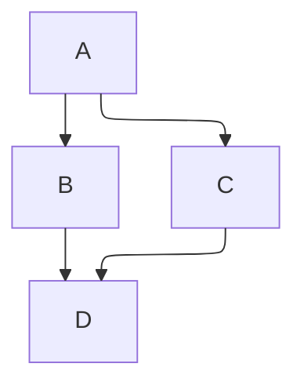

# Docusaurus

## Setup

- `npx create-docusaurus@latest my-website classic --typescript`.
- Update: Change version of all `@docusaurus` packages in `package.json`. Run `npm install`.
- Dev: `npm run start`.

## Browser Support

- Specify production browsers in `package.json`.
- `npx browserslist --env="production"` to list target browsers.

## Block AI Bots

Copy [ai-robots-txt/ai.robots.txt](https://github.com/ai-robots-txt/ai.robots.txt) to `static/robots.txt`.

## Standalone Page (src/)

- Create in `src/` folder. Use React or Markdown.
- No sidebar.
- Excluded files
  - `_` prefixed
  - `.test.js`
  - `__tests__` folder

### React

```tsx title="src/pages/something.tsx"
import Layout from '@theme/Layout';

export default function Something() {
  return <Layout title='Something'></Layout>;
}
```

### Markdown

```mdx title="src/pages/something.mdx"
---
title: Markdown title or "id".

description: Default to first line of the document.
image: Added to head tag.

slug: custom url. /routeBasePath/slug.
draft: false (only available during development)
unlisted: false (available in both dev and prod, but not indexed, excluded from sitemap, sidebar)
hide_table_of_contents: false
---

# Title
```

## Doc Page (docs/)

- Create in `/docs` folder.
- Excluded files
  - `_` prefixed

```mdx
---
title: Markdown title or "id".
sidebar_position: Float number.

description: Default to first line of the document.
image: Added to head tag.

slug: custom url. /routeBasePath/slug.
draft: false (only available during development)
unlisted: false (available in both dev and prod, but not indexed, excluded from sitemap, sidebar)
toc_min_heading_level: 2
toc_max_heading_level: 3

id: Unique ID to identify the page. Default is file path.
sidebar_label: Default to "title". Text shown in the sidebar.
pagination_label: Text used in prev/next buttons for this document.
displayed_sidebar: Change the shown sidebar object. Use the ID from `sidebars.ts`.
hide_title: false
hide_table_of_contents: false
pagination_next: ID of next page. "null" to disable next button.
pagination_prev: ID of previous page. "null" to disable prev button.
custom_edit_url: Use "null" to disable showing Edit this page.
last_update: To provide custom value
  - date
  - author
---

# Title
```

## Markdown

Prettier does not support MDXv3. Use `{/* prettier-ignore */}` when formatting breaks.

### Admonitions

`note`, `tip`, `info`, `warning`, `danger`

```
::::note[Custom title]

Some **content** with _Markdown_ `syntax`. Check [this `api`](#).

:::tip

Some **content** with _Markdown_ `syntax`. Check [this `api`](#).

:::

::::
```

::::note[Custom title]

Some **content** with _Markdown_ `syntax`. Check [this `api`](#).

:::tip

Some **content** with _Markdown_ `syntax`. Check [this `api`](#).

:::

::::

:::tip

Some **content** with _Markdown_ `syntax`. Check [this `api`](#).

:::

:::info

Some **content** with _Markdown_ `syntax`. Check [this `api`](#).

:::

:::warning

Some **content** with _Markdown_ `syntax`. Check [this `api`](#).

:::

:::danger

Some **content** with _Markdown_ `syntax`. Check [this `api`](#).

:::

### Assets/Images

- Images
  - Use relative links to locate file in `docs` folder from current `mdx` file.
- Files
  - Can use absolute path.

```tsx


import Image from '../assets/image.png';


```

### Code

- [Supported languages](https://prismjs.com/#supported-languages).
- Title `title="/src/Hello.js"`.
- Line numbers `showLineNumbers=2`.
- Highlight lines
  - `// highlight-next-line`
  - `// highlight-start` and `//highlight-end`
  - `{1,4-6,11}`
  - Different color
    - `note-next-line`, `note-start`, `note-end`.
    - `tip-next-line`, `tip-start`, `tip-end`.
    - `info-next-line`, `info-start`, `info-end`.
    - `warning-next-line`, `warning-start`, `warning-end`.
    - `danger-next-line`, `danger-start`, `danger-end`.
  - Diffs
    - `added-next-line`, `added-start`, `added-end`.
    - `removed-next-line`, `removed-start`, `removed-end`.
- Use `<pre>`, `<code>`, or `<CodeBlock>` for HTML content.

```tsx title="Something" showLineNumbers
// highlight-next-line
highlight;
// note-next-line
note;
// tip-next-line
tip;
// info-next-line
info;
// warning-next-line
warning;
// danger-next-line
danger;
// added-next-line
added;
// removed-next-line
removed;
```

### Components

- `@site/src/components` or local directory with `.tsx`.
- Specify global components in `src/theme/MDXComponents.ts`.

```tsx
export const Component = ({ children }) => <span>{children}</span>;

import OtherComponent from '@site/src/components/OtherComponent';

<Component>Something</Component>;
```

### Details

```html
<details>
  <summary>Toggle me!</summary>

  Main content.
</details>
```

<details>
  <summary>Toggle me!</summary>

Main content.

</details>

### Diagram

- [Mermaid](https://mermaid-js.github.io/mermaid/).
- Use Mermaid component for dynamic diagrams `import Mermaid from '@theme/Mermaid`.
- Default engine `dagre`.
  - `elk` is heavier and better for complex diagrams.

````text

````


### File

```tsx
import CodeBlock from '@theme/CodeBlock';
import MyComponentSource from '!!raw-loader!./myComponent'; // Local import
import MyComponentSource from '!!raw-loader!@site/src/components/myComponent.tsx';

<CodeBlock language='tsx'>{MyComponentSource}</CodeBlock>;
```

To import Markdown use `_` prefixed files.

```mdx title="_temp.mdx"
<span>Hello {props.name}</span>.
```

```mdx title="main.mdx"
import MarkdownCode from './_file.mdx';

<MarkdownCode name='Sebastien' />
```

### Footnote

```
A note[^1].

[^1]: Big note. Will appear at the bottom of the page with the header "Footnotes".
```

A note [^1].

[^1]: Big note. Will appear at the bottom of the page with the header "Footnotes".

### Math

- [Supported functions](https://katex.org/docs/supported).
- [Supported symbols](https://katex.org/docs/support_table).
- Use `<CodeBlock language="math">` instead of `$$`.

````text
```math
I = \int_0^{2\pi} \sin(x)\,dx
```
````

```math
I = \int_0^{2\pi} \sin(x)\,dx
```

### Newline

```
A backslash\
before a line break.
```

A backslash\
before a line break.

### Links

- Relative link `[link](../target.mdx)`.
- Absolute from `docs` folder `[link](/folder/target.mdx)`.

### Quote

```
> Quote
>
> Continue
```

> Quote
>
> Continue

### Table

```
| a   | b   |   c |  d  |
| --- | :-- | --: | :-: |
| 123 | as  |  ab | asd |
```

| a   | b   |   c |  d  |
| --- | :-- | --: | :-: |
| 123 | as  |  ab | asd |

### Tabs

- `lazy` to only render default tab.
- `groupId` to sync.
- `queryString` to add tab ID to URL.

```tsx
import Tabs from '@theme/Tabs';
import TabItem from '@theme/TabItem';

<Tabs groupId="tab-example">
  <TabItem value="apple" label="Apple" default>
    Apple
  </TabItem>
  <TabItem value="orange" label="Orange">
    Orange
  </TabItem>
  <TabItem value="banana" label="Banana">
    Banana
  </TabItem>
</Tabs>

<Tabs
  groupId="tab-example"
  defaultValue="apple"
  values={[
    {label: 'Apple', value: 'apple'},
    {label: 'Orange', value: 'orange'},
    {label: 'Banana', value: 'banana'},
  ]}>
  <TabItem value="apple">Apple</TabItem>
  <TabItem value="orange">Orange</TabItem>
  <TabItem value="banana">Banana</TabItem>
</Tabs>
```

import Tabs from '@theme/Tabs';
import TabItem from '@theme/TabItem';

<Tabs groupId='tab-example'>
  <TabItem value='apple' label='Apple' default>
    Apple
  </TabItem>
  <TabItem value='orange' label='Orange'>
    Orange
  </TabItem>
  <TabItem value='banana' label='Banana'>
    Banana
  </TabItem>
</Tabs>

<Tabs
  groupId='tab-example'
  defaultValue='apple'
  values={[
    { label: 'Apple', value: 'apple' },
    { label: 'Orange', value: 'orange' },
    { label: 'Banana', value: 'banana' },
  ]}
>
  <TabItem value='apple'>Apple</TabItem>
  <TabItem value='orange'>Orange</TabItem>
  <TabItem value='banana'>Banana</TabItem>
</Tabs>

### Tasklist

```
- [ ] Todo
- [x] Done
```

- [ ] Todo
- [x] Done

### Thematic Break

```
---
```

---

## Static Assets

- `static` folder copied directly to final build.
- `static/img/some.png` served as `{baseUrl}/img/some.png`.

```tsx
// Method 1
;

// Method 2
import ImgUrl from '@site/static/img/some.png';

;

// Method 3
;

// Method 4
import useBaseUrl from '@docusaurus/useBaseUrl';

;
```
