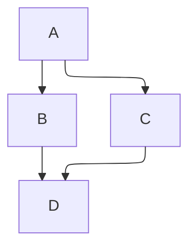

# Docusaurus

## Setup

- Create site `npx create-docusaurus@latest my-website classic --typescript`.
- To update change version of all `@docusaurus` packages in `package.json`, and run `npm install`.
- Dev server `npm run start`.
- Build site `npm run build`.

## Standalone Page

- No sidebar.
- Create directory for each page in `src/pages` and create `index.js`. This benefits from co-locating all styles and other assets in the same directory for each page.
- Files prefixed with `_`, test files `.test.js`, and files placed in `__tests__` directory are not turned to pages.

### React

Created in `src/pages/something.tsx` and served at `/something`. To add header and footer use `<Layout>`.

```tsx
import Layout from '@theme/Layout';

export default function Something() {
  return (
    <Layout title='Something'>
      <p>Something</p>
    </Layout>
  );
}
```

### Markdown

Created in `src/pages/something.mdx` and served at `/something`. Includes header and footer.

```mdx
---
title: Markdown title or "id".

description: Default to first line of the document.
image: Added to head tag.

slug: custom url. /routeBasePath/slug.
draft: false (only available during development)
unlisted: false (available in both dev and prod, but not indexed, excluded from sitemap, sidebar)
hide_table_of_contents: false
---

# Title
```

## Doc Page

- Created in `/docs` folder.
- Files prefixed with `_` are not turned to pages.
- Each page has an ID which by default is the name of the document (without the extension) relative to the root docs directort. The ID is used when hand-writing the sidebar.
- Providing slug to each page is recommended to decouple filename from the route.
- Sidebar position
  - Filenames can be prefixed with numbers, but this can cause issues when referencing the pages within markdown. Avoid this.
  - Provide info in the markdown frontmatter, or use `_category.json` file to provide the same.

```mdx
---
title: Markdown title or "id".
sidebar_position: Float number.

description: Default to first line of the document.
image: Added to head tag.

slug: custom url. /routeBasePath/slug.
draft: false (only available during development)
unlisted: false (available in both dev and prod, but not indexed, excluded from sitemap, sidebar)
toc_min_heading_level: 2
toc_max_heading_level: 3

id: Unique ID to identify the page. Default is file path.
sidebar_label: Default to "title". Text shown in the sidebar.
pagination_label: Text used in prev/next buttons for this document.
displayed_sidebar: Change the shown sidebar object. Use the ID from `sidebars.ts`.
hide_title: false
hide_table_of_contents: false
pagination_next: ID of next page. "null" to disable next button.
pagination_prev: ID of previous page. "null" to disable prev button.
custom_edit_url: Use "null" to disable showing Edit this page.
last_update: To provide custom value
  - date
  - author
---

# Title
```

## Markdown

### Footnote

```
A note[^1]

[^1]: Big note. Will appear at the bottom of the page with the header "Footnotes".
```

A note [^1]

[^1]: Big note. Will appear at the bottom of the page with the header "Footnotes".

### Tasklist

```
- [ ] Todo
- [x] Done
```

- [ ] Todo
- [x] Done

### Table

```
| a | b  |  c |  d  |
| - | :- | -: | :-: |
```

| a   | b   |   c |  d  |
| --- | :-- | --: | :-: |

### Horizontal Rule

```
---
or
***
```

---

### Newline

Use `\` to add `<br>`.

```
A backslash\
before a line break.
```

A backslash\
before a line break.

### Quote

```
> Quote.
>
> Continue.
```

> Quote.
>
> Continue.

### Details

`<details>` support. Check the console after adding details, to make sure there are no errors.

```html
<details>
  <summary>Toggle me!</summary>

  Main content.
</details>
```

<details>
  <summary>Toggle me!</summary>

Main content.

</details>

### Formatter

Prettier does not support MDXv3. Use `{/* prettier-ignore */}` to ignore next node from formatting when error occurs.

### Components

- Write component in `@site/src/components` or local directory with `.tsx`.

  ```mdx
  export const Component = ({ children }) => <span>{children}</span>;

  import OtherComponent from '@site/src/components/OtherComponent';

  <Component>Something</Component>
  <span style={{ backgroundColor: 'red' }}>Inline styles</span>
  ```

- To make component global specify it in `src/theme/MDXComponents.ts`.

  ```tsx
  import MDXComponents from '@theme-original/MDXComponents';
  import MyComponent from '@site/src/components/MyComponent';

  export default {
    // Re-use the default mapping
    ...MDXComponents,

    // Add your components down here
    MyComponent,
  };
  ```

### Add File Contents

```mdx
import CodeBlock from '@theme/CodeBlock';
import MyComponentSource from '!!raw-loader!./myComponent'; // Local import
import MyComponentSource from '!!raw-loader!@site/src/components/myComponent.tsx';

<CodeBlock language='tsx'>{MyComponentSource}</CodeBlock>
```

### Importing Markdown Content

- Write the content in file prefixed with `_`.
- Use `{props.name}` for component props.
  ```mdx
  <span>Hello {props.name}</span>.
  ```
- Import content.
  ```mdx
  import MarkdownCode from './_file.mdx';
  <MarkdownCode name="Sebastien" />
  ```

### Tabs

- All Tabs are rendered.
- To only render the default tab use `<Tabs lazy />`.
- Use `<Tabs groupId="operating-system">` to sync tabs.
  - Tabs do not need to have the same list of values. If a value does not exist, the value won't change in other groups.
  - To persist the selected tab in the URL use `<Tabs queryString="current-os" queryString>`.

```tsx
import Tabs from '@theme/Tabs';
import TabItem from '@theme/TabItem';

<Tabs groupId="tab-example">
  <TabItem value="apple" label="Apple" default>
    This is an apple 🍎
  </TabItem>
  <TabItem value="orange" label="Orange">
    This is an orange 🍊
  </TabItem>
  <TabItem value="banana" label="Banana">
    This is a banana 🍌
  </TabItem>
</Tabs>

<Tabs
  groupId="tab-example"
  defaultValue="apple"
  values={[
    {label: 'Apple', value: 'apple'},
    {label: 'Orange', value: 'orange'},
    {label: 'Banana', value: 'banana'},
  ]}>
  <TabItem value="apple">This is an apple 🍎</TabItem>
  <TabItem value="orange">This is an orange 🍊</TabItem>
  <TabItem value="banana">This is a banana 🍌</TabItem>
</Tabs>
```

import Tabs from '@theme/Tabs';
import TabItem from '@theme/TabItem';

<Tabs groupId="tab-example">
  <TabItem value="apple" label="Apple" default>
    This is an apple 🍎
  </TabItem>

<TabItem value='orange' label='Orange'>
  This is an orange 🍊
</TabItem>

  <TabItem value="banana" label="Banana">
    This is a banana 🍌
  </TabItem>
</Tabs>

<Tabs
  groupId='tab-example'
  defaultValue='apple'
  values={[
    { label: 'Apple', value: 'apple' },
    { label: 'Orange', value: 'orange' },
    { label: 'Banana', value: 'banana' },
  ]}
>
  <TabItem value='apple'>This is an apple 🍎</TabItem>
  <TabItem value='orange'>This is an orange 🍊</TabItem>
  <TabItem value='banana'>This is a banana 🍌</TabItem>
</Tabs>

### Code Blocks

- [Supported languages](https://prismjs.com/#supported-languages).
- Add title `jsx title="/src/Hello.js"`.
- Highlight lines.
  - `// highlight-next-line`.
  - `// highlight-start` and `//highlight-end`.
  - `jsx {1,4-6,11}`. Avoid this.
- For highlighting lines the same naming scheme as Admonitions is used
  - `note-next-line`, `note-start`, `note-end`.
  - `tip-next-line`, `tip-start`, `tip-end`.
  - `info-next-line`, `info-start`, `info-end`.
  - `warning-next-line`, `warning-start`, `warning-end`.
  - `danger-next-line`, `danger-start`, `danger-end`.
- For github style diffs.
  - `added-next-line`, `added-start`, `added-end`.
  - `removed-next-line`, `removed-start`, `removed-end`.
- Add line numbers `jsx showLineNumbers=2`.
- Codeblocks preserve their content as plain text. To use HTML tags, use `<pre>`, `<code>`, or `<CodeBlock>` component.

```tsx title="Something" showLineNumbers
// note-next-line
let x = 1;
// tip-next-line
let x = 1;
// info-next-line
let x = 1;
// warning-next-line
let x = 1;
// danger-next-line
let x = 1;
// added-next-line
let x = 1;
// removed-next-line
let x = 1;
```

### Admonitions

- `note`, `tip`, `info`, `warning`, `danger`.

```
::::note[Custom title]

Some **content** with _Markdown_ `syntax`. Check [this `api`](#).

:::tip

Some **content** with _Markdown_ `syntax`. Check [this `api`](#).

:::

::::
```

::::note[Custom title]

Some **content** with _Markdown_ `syntax`. Check [this `api`](#).

:::tip

Some **content** with _Markdown_ `syntax`. Check [this `api`](#).

:::

::::

:::tip

Some **content** with _Markdown_ `syntax`. Check [this `api`](#).

:::

:::info

Some **content** with _Markdown_ `syntax`. Check [this `api`](#).

:::

:::warning

Some **content** with _Markdown_ `syntax`. Check [this `api`](#).

:::

:::danger

Some **content** with _Markdown_ `syntax`. Check [this `api`](#).

:::

### Assets

- For Image assets, you have to use relative links. But for files you can use absolute path.
- Use relative links from MDX file to locate image in `docs` folder. Example `../assets/image.png` will get `docs/assets/image.png` if the current MDX file is in `docs/folder/file.mdx`.

  ```
  

  


  import Image from '../assets/image.png';

  
  ```

### Links

- Relative link `[link](../target.mdx)`.
- Absolute from `docs` folder `[link](/folder/target.mdx)`.

### Math

- List of [supported function](https://katex.org/docs/supported) and [support table](https://katex.org/docs/support_table).
- Use codeblock syntax with `math` language instead of `$$`.

````text
```math
I = \int_0^{2\pi} \sin(x)\,dx
```
````

### Diagram

- [Mermaid](https://mermaid-js.github.io/mermaid/) is used.
- For dynamic diagrams use `import Mermaid from '@theme/Mermaid` component.
- Default engine `dagre`. `elk` is heavier and better for complex diagrams.

````text

````


## Styling

- Global styles in `src/css/custom.css` and import in `docusaurus.config.ts`.

## Static Assets

- Place in `static` folder and copied as it to the final build.
- `static/img/some.png` served as `{baseUrl}/img/some.png`.
- Reference static assets.
  - Markdown links automatically changed to include the baseUrl. No need to provide `static` as well.
    ```mdx
    
    ```
  - Import.

    ```mdx
    import DocusaurusImageUrl from '@site/static/img/docusaurus.png';

    ;
    ```

  - Require.
    ```mdx
    
    ```
  - useBaseUrl

    ```mdx
    import useBaseUrl from '@docusaurus/useBaseUrl';

    ;
    ```

## Browser Support

- Specify the production browsers in `package.json`.
- Use `npx browserslist --env="production"` to check the list of browsers.

## Block AI Bots

- Use [ai-robots-txt/ai.robots.txt](https://github.com/ai-robots-txt/ai.robots.txt) to copy `robots.txt`.
