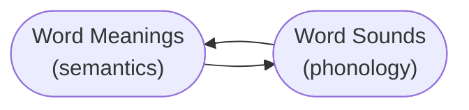

<!-- prettier-ignore-start -->
# The Reading Mind: A Cognitive Approach To Understanding How The Mind Reads
{: .no_toc }

  

    Table of contents
  

  {: .text-delta }
1. TOC
{:toc}

<!-- prettier-ignore-end -->

## Resources

- [link](https://www.amazon.com/Reading-Mind-Cognitive-Approach-Understanding/dp/1119301378) The Reading Mind: A Cognitive Approach to Understanding How the Mind Reads by _Daniel T. Willingham_ (256 pages) (May 1, 2017)

---

## How we read

---

- Both located in separate parts of the brain. Because brain damage can compromise one without much affecting the other.
- We can pronounce words of whom we don't know the meaning of.
- We know a phenomena, but don't know the sound for it.

## Mind v/s Brain

- **Mind** - Similar to algorithm.
- **Brain** - Hardware that executes the algorithm.

## Goal of book

Take a cognitive approach to describe the steps by which the mind (of an experienced reader) reads without specifying how the brain carries out those steps.

_Sociocultural view_ not included in this.

- Role of social environment in reading, what you read, how often you read, your interpretation of what you read.

### Why psychologists not focus on brain

- Hard to describe the steps, and the steps are ever evolving with our understanding of the field.
    - The steps used are indicative of our current knowledge.
- Most of the mind is recruited to address even moderately complex tasks, so the explanation would be dauntingly complex.

## History

- Reading is 6,000 years old.
    - Writing was invented on at least three separate occasions: about 5300 years ago in Mesopotamia, 3400 years ago in China, and 2700 years ago in Mesoamerica.
    - Speaking came around 80,000 years ago.
    - Texting is closer to speaking (subconcious and rapid) than writing (deliberate and slow).
    - Emoji's main purpose is to convey emotion (vocal tone and facial expression), which are missing from written communication. They do suffer from the problems of logograph of not having a shared meaning and having no set meaning for a sequence of emojis.
- English has Germanic origins, heavily influenced by the Norman invasion and later by the adoption of Latinate and Greek words.

## Traits of a strong reader

- Since writing codes spoken language. There is strong relationship between oral comprehension and reading comprehension.
- Good at phonemic and phonological awareness (ability to hear individual speech sounds) tasks.
    - Rhyming and alliteration games can be used for training.
    - Sounds that children learn till age 7 form the basis of their accent.

## Why we read

- Cognitive psychologists start with "why" (purpose) before "how".

### Purpose of reading

- To understand thoughts: either someone eles's thoughts, or our own thoughts from the past.

### Purpose of writing

- To preserve one's own thoughts, and to transmit thoughts to others.
- Writing is an extension of memory. Creating new memory takes effort, while it is easier to create new written records.
- Speech requires you to be present at the same place as the speaker. Writing preserves that makes it portable.

### How writing came to be

- **Pictographs** - A picture that carries meaning.
    - Advantages - Writing them requires no training, and they are readily interpretable.
    - Disadvantages - Open to misinterpretation. Some things are hard to put in a picture, like danger, genius.
- **Logographs** - Images that act as symbols and have a defined meaning.
    - Advantages - Gained specificity and flexibility and can represent abstract ideas like danger.
    - Disadvantages - The writer/reader needs to be trained, and have to memorize abstract symbols.
        - Conveying grammar, time, counterfactual states is hard. _The ram is here_ vs _The ram was here_.
- **Sumerian cuneiform and Egyptian hieroglyphics** - Some symbols in logographs would be used to convey sound. This is how they solved grammar issue.
- **Phonetic writing system** - Symbols stand for sound, not meaning.
    - English is mostly phonetic writing system, since it contains logographs "$", "&".
    - Writing essentially becomes a code for what you say, not what you think. And it makes using grammar effortless.
    - This also means children don't need explicit instruction in vocabulary or syntax, exposure to a community of speakers is enough.
    - In English alphabetic system is sued. Each symbol corresponds to a speech sound called a _phoneme_ (44 phonemes in English and 26 letters).

### How writing affects reading

1. Visually distinguish one letter from another, exmaple "b" from "p".
2. Describe the difference between sound of "bump" and "pump".
3. Know the mapping between the visual and auditory components.

## Challenges reading what is written

### Identifying the letters

- Good and struggling readers are simialr in this area.
- English alphabet is not easy to distinguish and not easy to write.
- Letters came from natural shapes. Like "L" is very commonly observed in the environment when two edges meet. People making the alphabet unconsciously used the shapes that appeared most frequently in the environment.
- Letters vary in the number of hand movements they require to write. "L" requires two, "X" requires three.
- Each letter in our brain is broken down into simple lines. The lines overcome differences in font, size. And is the reason why "b" and "d" are hard to read.

### Hearing sound of words

- Phonemic awareness separates good readers from bad readers.
- Children struggle where one spoken word ends and another begins.
- When speaking pauses between words are created by our mind, not by the words itself. When you hear a foreign language you don't hear any breaks.
- Why learning to hear speech sounds is hard
    1. Regional accents.
    2. Context changes the sound. "pot" vs "spot" the "p" sound is different.
    3. Sound of letter depends on relationship of neighboring sounds. "p" cannot be said in isolation.

### Use context to get sound of words

- Good and struggling readers are similar in this area.
- English uses many-to-many mapping between letters and sounds. The context is what makes the pronunciations more consistent.
- To practice this show children an arbitrary shape, and ask them to learn what it's called. It does not work the other way, where you ask the child to pick out the shape.

continue from page 55
