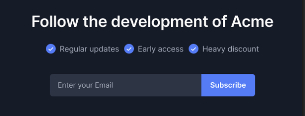
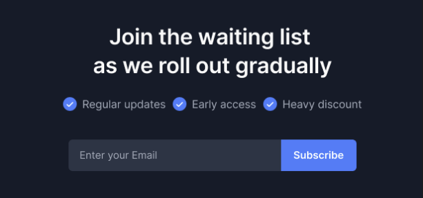
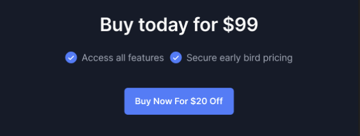
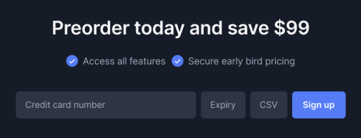
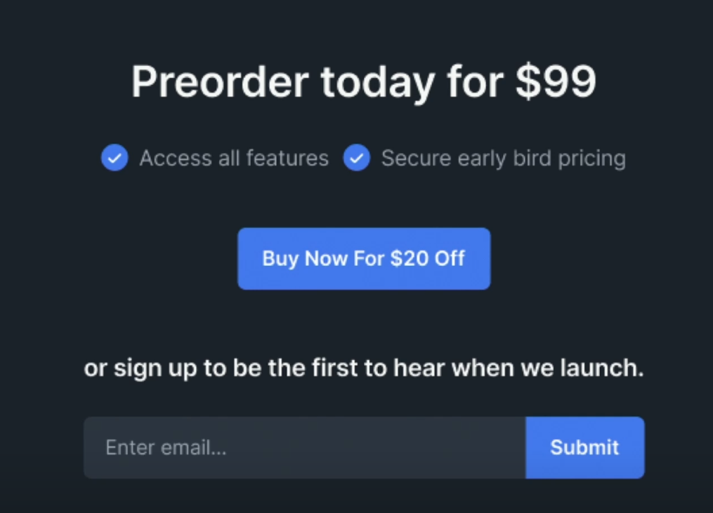
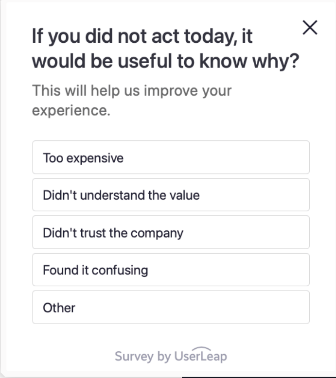
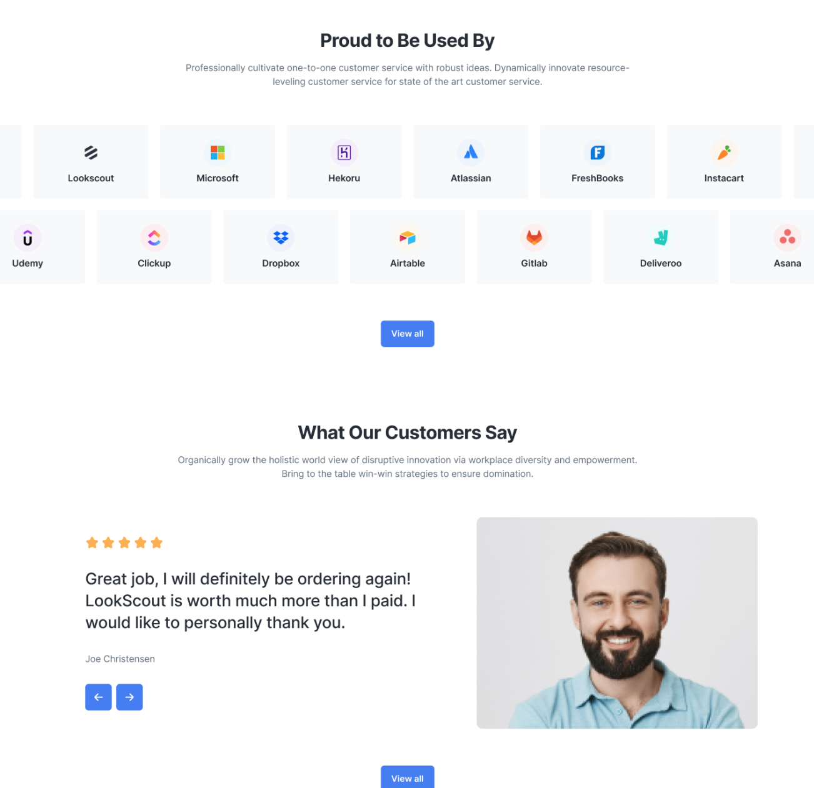
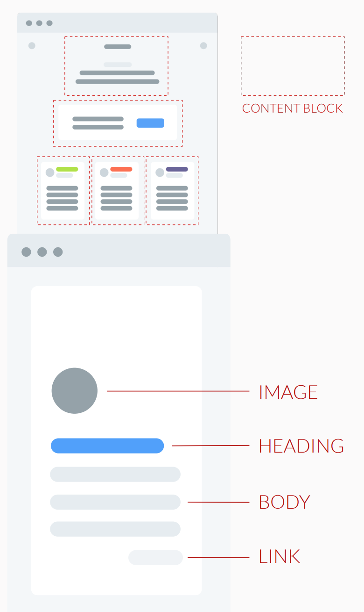
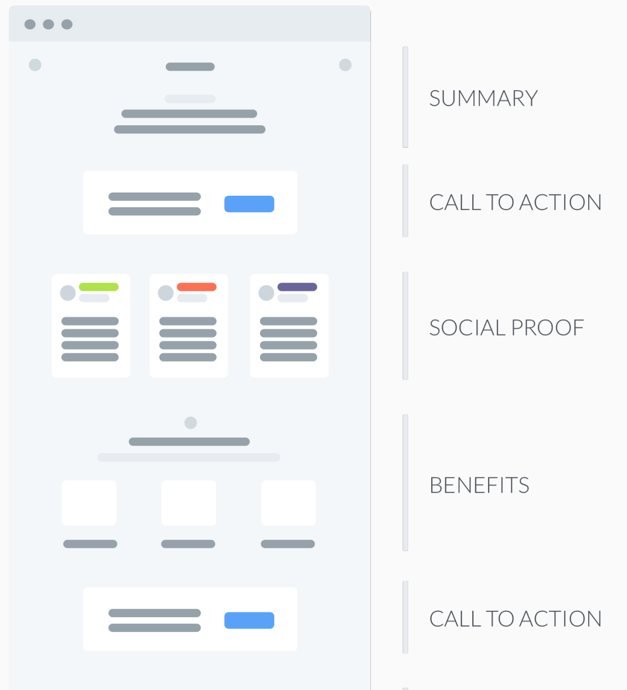
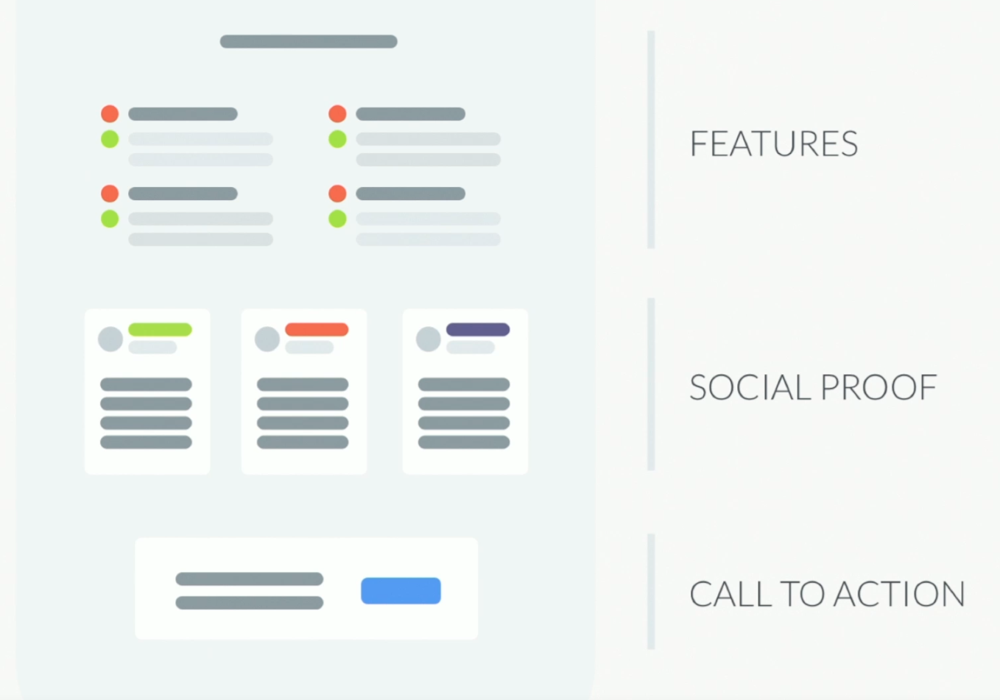

<!-- prettier-ignore-start -->
# Market Analysis
{: .no_toc }

<details open markdown="block">
  <summary>
    Table of contents
  </summary>
  {: .text-delta }
1. TOC
{:toc}
</details>

<!-- prettier-ignore-end -->

## Resources

-   [link](https://frontendmasters.com/courses/product-launch/) Guide for Launching Your Next Big Idea by _Paul Boag_ (2 hours 55 minutes) (May 30, 2024)

---

## Why startups fail

-   Do not build a startup with the goal of passive income, as 90% of startups fail.
-   **No real problem** - Fail to solve a meaningful problem to others (not you).
-   **Poor marketing** - Do not have a robust strategy for acquiring and retaining customers.
-   **No differentiation** - Without a clear way of differentiating from others, it is hard to break through.

## Why do startup

-   Escape the 9 to 5.
-   Escape hourly ceiling.
-   Escape the boss and clients, with the caveat that the cusotmers become the boss.
-   Additional revenue stream.

### Exceptions

-   For fun.
-   To learn.
-   To help out community, organization, or person.

## 4 step process

1. Review the market.
2. Understand your audience.
3. Define your minimum viable product.
4. Run a test marketing campaign.

## 1. Review the market

**Goal** - Before taking any action, it's crucial to understand who else is addressing similar issues and the current market landscape.

### Why do market research

-   **Define your audience** - Find the niche to target.
-   **Define your features** - What features to build initially.
-   **Identify market challenges** - What challenges you may face when you attempt to go to market.
-   **Establish a strategy** - Help you establish a successful strategy.

### How to do market research

1. Broadly define your niche
    - **Your type of offering** - What type of app are you creating and what is the rough extent of its functionality.
    - **Your particular audience** - What specific audience are you going to initially focus on when initially launching the product.
    - Do not go too broad. The smaller the audience the more you will get out of your limited marketing budget.
    - We will still build a generic website to be open to the broadest possible audience. And use specific landing pages to target different sectors without excluding others.
    - For example, frontend masters focus on developers, and developers talk amongst themselves, follow common socials, and word-of-mouth helps you grow and build trust. Later, you use their testimonials when going to larger audience.
2. Find your competitors (check [What to look for in competitors](#what-to-look-for-in-competitors))
    - Simple keyword search
    - Product Hunt
    - G2
    - Social media and forms
    - Industry reports
    - SEO and SEM tools
    - Events
    - Talk to your audience
    - News and publications
3. Try the competition's offering
    - Sign up for demos and free trials for the biggest players in the market.
    - Assess features, usability.
    - Send email to test customer support.
    - Make a list of good and bad things they do.
4. Pay attention to competition reach
    - **Advertising** - Are they paying for PPC advertising and do they appear on websites relevant to your users. Inferior products might be spending too much on marketing, which you will have to compete with.
    - **Social** - How many followers do they have, how often do they post, do people respond positively. Use BuzzSumo, Mention.com to gauge customer satisfaction.
    - **Media** - How often are they mentioned on media site.

### What to look for in competitors

-   Features and functionality
    -   **Core offering** - What is the focus of their app and what features do they promote the most.
    -   **Unique features** - What makes their app different from the other competitors and potentially your app. Are they nice to have or crucial to the experience of the users you are trying to reach.
    -   **Integration** - What platforms do they integrate with, and what does that integration allow.
-   User experience
    -   **Onboarding** - What is the first-time user experience like. Is the app easy to pick up or do you need support. If you know a feature is hard to use, then you can make it easier.
    -   **Repeat use** - Do certain actions become annoying over time.
    -   **Accessibility** - Does the app work for a variety of audiences across different platforms and devices.
-   Market position
    -   **Audience** - Who are the primary customers. Look for segments they might be overlooking.
    -   **Pricing** - Analyze their pricing models, tiers, and any free trail or freemium options.
    -   **Brand** - Value proposition and key benefits they highlight to the users.
-   Market strategy
    -   **Digital presence** - Look at their site and landing pages to understand how they convert visitors. How content is structures on their site.
    -   **Content marketing** - Understanding their keywords and content strategy can reveal a lot about how they reach people.
    -   **Paid advertising** - Check their paid channels, such as Google Ads or social media advertising.
-   Customer feedback
    -   **Reviews and ratings** - G2 or Capterra can provide insights into what customers like and dislike about your competitor's solution.
    -   **Case studies and testimonials** - Can offer deeper insights into successful use cases and customer experiences.
-   Company health
    -   **Funding and investment** - Recent funding rounds or financial backing can indicate their capacity for growth and development. Since investors demand a lot, companies that have got a lot of funding can be under pressure and start performing bad.
    -   **Growth metrics** - Look for data on user base growth, market share, or geographic expansion.
-   Innovation
    -   **New features or products** - Keep and eye on their product updates, new releases and roadmap. They might release a new product and start focusing on that.
    -   **Patents and technologies** - These can indicate areas where they are innovating or investing heavily.
-   Technology
    -   **Performance** - Does the app run fast.
    -   **Reliability** - What is the uptime of the app like.
    -   **Security** - Have there been any reported security breaches.
    -   **Privacy** - How do they store and use customer data.

### How to use market research data

-   Spot gaps
    -   **Feature gaps** - Can include integration, data privacy and more.
    -   **Experience gaps** - Include both the app's UI and customer support.
    -   **Audience gaps** - Is there a niche or region that the compeitors fail to target.
-   Innovate
    -   **Technology** - Technology evolves the whole time, while your competitors are dealing with legacy.
    -   **Values** - People's values change over time, like sustainability and privacy are big now.
    -   **Business model** - Explore alternative business models such as flexible pricing or freemium.
-   Optimize
    -   **Faster** - Can you enable people to achieve more in less time.
    -   **Better** - Can you offer the ability to do more or do it to a higher standard.
    -   **Cheaper** - Can you offer the same service as competitors, but at a lower price point.

### How to differentiate

-   Features and functionality
    -   **Solve unaddressed problems** - Use market research and user feedback to find problems that competitors haven't solved or have inadequately addressed.
    -   **Enhance existing features** - Take existing features common in your market segment and enhance them, like making them faster, more user-friendly, or more powerful.
-   Technology
    -   **Emerging tech** - Build in new technologies such as AI from the start.
    -   **Security** - Offer improved privacy and security by complying with stricter standards.
    -   **Performance** - Ensure your platform is faster and more reliable with better uptime.
-   User experience
    -   **Onboarding** - Make it easier for users to pick up the app and start using it.
    -   **Repeat use** - Ensure that the app is easier for completing common and repetitive tasks.
    -   **Accessibility** - Make the app accessible to the broadest possible audience.
-   Pricing
    -   **Subscription vs one-off** - If your competitors all offer subscriptions, consider charging a one-off fee.
    -   **Freemium** - Offering a free tier can be an effective way of establishing yourself in a crowded market.
    -   **Free** - Consider a free service supported by tips or a small slice of users sale.
    -   **Value added features** - Explore a lower base price, supported by a chargeable extra features. Most established products have added feature over time and provide everything as a bundle. You can choose a feature and provide that at a separate price.
-   When targeting B2B audience
    -   **Vertical** - Focus on a different vertical sector and build to meet their specific needs. For example, build a CMS for higher education sector. This helps you compete with big players like Wordpress.
    -   **Size** - If competitors focus on enterprise, consider focusing on SMEs or vice versa.
    -   **Region** - Consider focusing on a specific country or region to accomodate their unique situation.
-   When targeting B2C audience
    -   **Interests** - Focus on a different use case for your app based on the interests of your audience. For example, building an app similar to Notion but only focusing on people who play fantasy football.
    -   **Demographics** - If competitors focus on a particular age group or level of education then focus elsewhere.
    -   **Region** - Consider focusing on a specific country or region to accomodate their unique situation.
-   Community building
    -   Do not treat customers as cash cows.
    -   **Support** - Provide a space where users can support one another and share ideas.
    -   **Create** - Allow people to create templates and plugins or build upon your app and what it offers.
    -   **Thought leadership** - Provide advice and articles that relate to your app and the challenges it solves.
-   Customer support
    -   24/7 support - Can be outsourced.
    -   Multi-channel - Like phone, email, discord.
    -   Self-service support.
    -   Fast responses.
    -   Community driven.
    -   **Personalized**.
    -   Public roadmap.
-   Flexibility
    -   **Customization** - Provide the ability to customize everything from the output to the user interface.
    -   **APIs** - Allow people to build on your app programmatically.
    -   **Plugins** - Allow people to expand the capability of the app by creating and sharing plugins.
-   Branding
    -   **Value proposition** - How you explain your app and the benefits it provides can set you apart from competitors.
    -   **Tone of voice** - A strong tone of voice can make you stand out from more bland competitors. Just becuase you are targeting corporate does not mean you have to be formal. The people working there also share the same humor as you.
    -   **Design language** - Investing in art direction and a clear visual language makes your brand memorable.\
        Mailchimp had this feature, where after sending an email it would high five you and you can tap the hand and it would turn into a fist.\
        You can add pop out text boxes like "Woohoo! Finished this week's work. Now I can enjoy the weekend."

### Decide if you want to compete

-   Reviewing the market can lead to the harsh realization that it will be hard to compete without considerable investment.
-   Instead of starting a new business, you can reach out to the competitors and offer them help. Look into channel partnerships or plugin marketplace. After you have got your foot in, you can explore starting your own business as well.
-   Be careful about making your idea dependent on other business. Like Amazon collects data on people who sell on their marketplace, and then they just copy your product. Or you create a plugin, but then the company decides to copy the plugin or break the API, like Twitter disabled their API.

## 2. Understand your audience

**Goal** - Motivate your audience by being highly focused and understanding of their needs.

### Adapt app to audience

-   **Features** - What precisely the app will do should be tailored to the needs of your audience.
-   **Top tasks** - Which features you highlight will depend on what your audience uses most.
-   **Messaging** - How you communicate with your audience will be dependent on who they are.
-   Do not develop an app and try to find an audience for it, since the finding the perfect audience is improbable.

### How to pick audience

#### 1. Identifying possible audiences

-   Identify as many possible groups of people who might be interested in your application.
-   For B2B audience
    -   **Verticals** - List every sector in which your app could be used.
        -   Healthercare
        -   Higher education
        -   Charities
        -   Finance
        -   Technology
    -   **Size** - List all the organizations of different sizes that your app could help.
        -   Revenue
        -   Employees
        -   Market share
        -   Assets
        -   Valuation
    -   **Region** - Does your app work globally, or are there region-specific limitations.
        -   Geographic region
        -   Country
        -   States
        -   City
        -   Zip code
-   For B2C audience
    -   **Interests** - List any interest areas that are relevant to your app and which it could support.
        -   Sports
        -   Hobbies
        -   Media
        -   Values
        -   Lifestyle
    -   **Demographics** - Are there age groups that the app could specifically appeal to.
        -   Age
        -   Gender
        -   Education
        -   Income
        -   Family
    -   **Region** - Does your app work globally, or are there region-specific limitations.
        -   Geographic region
        -   Country
        -   States
        -   City
        -   Zip code
-   Look at competition for inspiration
    -   Who they target - Where your competitors are advertising and what they choose to support.
    -   Who follows them - Review your competition's social feeds and pay attention to who buys their products and services.
-   Who is talking about the pain points you solve
    -   [buzzsumo.com](https://buzzsumo.com/)
    -   [hootsuite.com](https://www.hootsuite.com/)
    -   [mention.com](https://www.hootsuite.com/)
-   Look at related SEO terms
    -   For example, when creating a task app look at Google Search for related phrases that people use. You can use this info to choose content for SEO tagline.
    -   Google keyword manager
    -   Ahrefs
    -   SEMrush

#### 2. Shortlisting your audiences

-   Once you have a long list of potential audiences, narrow it down to those with the most potential.
-   Remove impractical options.
    -   For example, I don't know Chinese so no need to target them initially.
-   Prioritize the remaining options based on potential.
-   Market size and growth potential
    -   **Volume** - Is your audience large enough to sustain and grow your business, or will you need secondary audiences to supplement it. Some SASS only break even after a certain number of clients.
    -   **Growth** - Look for markets with growth potential. A stable or growing audience is more attractive than one in decline.
-   Market needs and paint points
    -   **Unique needs** - Does your product offer a compelling solution to the specific needs, problems, and pain points of the audience.
    -   **Underserved needs** - Look for gaps in current market offerings. Targeting an audience with unmet needs can position your app as a valuable solution.
-   Product fit
    -   **Alignment** - Do your product features, benefits, and user experience align with the target audience's preferences and requirements.
    -   **Adaptability** - How adaptable will your product needd to be to meet the evolving needs of the target audience.
-   Competitive landscape
    -   **Effectiveness** - How well does the competition meet the needs of the audience you are considering.
    -   **Saturation** - How many competitors are operating in the space.
    -   **Dominance** - How entrenched are the existing competitors. Is there a clear path to disrupt the sector. For example, VPN market is really hard to break in, because everyone spends so much money on advertising.
-   Buying power
    -   **Affordability** - Can your target audience afford the product you are proposing making.
    -   **Decision-making** - How much effort and how many challenges will the audience face in making a purchase.
-   Lifetime value
    -   **Profitability** - What will be the potential cost of the acquisition for your audience. This will impact the profit you make.
    -   **Retention** - How loyal do you predict your audience will be. How long do you expect to retain the customer.
-   Accessibility
    -   **Reachability** - Evaluate how easily you can reach your target audience with marketing and communication efforts.
    -   **Engagement** - Consider how willing the audience is to engage with your brand.
-   Regulatory environment
    -   **Compliance** - Be aware of any legal or regulatory requirements that may affect your ability to serve the target audience.
    -   **Barriers to entry** - Consider any potential barriers to entry, such as certifications, regulations, or high switching costs for customers.
-   Cultural fit
    -   **Values and preferences** - Do you understand the values and preferences of the audience you are trying to reach. Can you communicate effectively.
    -   **Language and localization** - Are there going to be costs associated with making your product accessible to different languages or regions.
-   Techincal savviness
    -   **User proficiency** - Evaluate the technical proficiency of the target audience. Your product's complexity should match the audience's ability to use it effectively.
    -   **Support and education** - Consider the level of support and education your target audience will need to successfully use your product.

#### 3. Pick an inital target

-   Select an initial audience that you are going to use to target for your minimum viable product and initial launch.
-   How to pick your audience
    -   **Potential** - Which audience do you consider to have the most potential.
    -   **Passion** - What audience make you most excited to be involved in.
    -   **Experience** - Which audience do you have insider knowledge of.
    -   **Community** - What audience has the most vibrant community.
-   How to research community
    -   **Influencers** - Are there influencers that you could engage to help promote the product.
    -   **Groups** - Are there online groups where your audience interact.
    -   **Blogs** - Are there blogs that your audience reads and relates to the topic of your product.
    -   **Events** - Are there events relating to your product that your audience attends.

#### 4. Dig deeper into your audience

-   Delve deeper to grasp the motivations and traits of the initial target audience. These factors will shape your communication and app functionality.
-   Primary things to know about audience
    -   **Questions** - What questions is the user seeking to answer.
    -   **Objections** - What might cause them not to act, or to abandon the experience.
    -   **Goal** - What is it they are ultimately trying to achieve.
-   Secondary things to know about audience
    -   **Tasks** - What actions do they need to take to achieve their goals.
    -   **State of mind** - How are users feeling during the experience. For example, in a fitness app users will feel different emotion when they complete a workout plan and when they fail to do so.
    -   **Influence** - What is influencing the experience the user is having.
    -   **Challenges** - What pain points are they facing that would put them off from using it.
-   How does the audience want us to interact with them i.e. the touchpoints
    -   Email
    -   Messaging
    -   Phone
    -   Website
    -   Search
    -   In-person
    -   Social media
    -   Online ads
    -   Offline ads
-   Do online research to get all this information
    -   Review communities
    -   Read related blogs
    -   SEO research
    -   Existing reports
    -   Social media
    -   Ask AI
-   Use all the information collected to find gaps in your market analysis
    -   Missing information
    -   Out of date information
    -   Suspect information - Info that we don't believe about users.
-   If we do find gaps
    -   Use surveys to validate. Pollfish can be used for this. In the survey, ask if they would be interested in doing a follow up interview.
    -   Interview the users. Ask these questions
        -   Background and context. Ask about the participants, their pain points, and their goals in using the service.
        -   How they use the service, and what challenges do they encounter.
        -   Needs and opportunities. How satisfied are they with the service, and what areas would they like to see improved.
        -   Open-ended feedback. Always try to end by asking if there is anything you have not covered or if they have final thoughts they would like to share.
-   Create an empathy/persona map
    -   Define name of person.
    -   **Feeling** - How is the user feeling about the experience.
    -   **Influences** What people, things, or places influence them.
    -   **Journey** - Where is the user in their experience and what (if any) interactions have they already had.
    -   **Goals** - What is the users ultimate goal. What are they trying to achieve.
    -   **Pain points** - What pain points are the users experiencing that they hope to overcome.
    -   **Questions and tasks** - What tasks are users trying to complete. What questions or objections do they need answering.

## 3. Define your minimum viable product

**Goal** - Working out what you intend to launch will be crucial for success and will also help define your approach to marketing.

### Why create MVP

-   **Define scope** - Helps prevent your build from dragging on and never being finished.
-   **Reduces cost** - By building the minimum, you can keep costs under control.
-   **Aids marketing** - MVP allows you to launch faster and better define your initial target audience.

### Steps to define MVP

#### 1. Brainstorm possible tasks

-   Identify as many of the tasks users might want to complete when using your application.
-   Look at the competition
    -   **What's there** - What tasks do the competitors support, and which ones do they most emphasize.
    -   **What's coming** - Do your competitors publish their roadmap, and if so, what upcoming tasks do they address.
    -   **What's missing** - What tasks are your competitors missing based on your experience and research.
-   Be inspired by your user research
    -   **Requests** - What tasks did people mention during your user research.
    -   **Pain points** - What tasks would users need to complete to address their pain points.
    -   **Goals** - Wat completed tasks would allow users to achieve their goals.
-   Ask AI

    ```
    I am trying to build a SaaS application for [audience] that enables them to [goal].

    So far, I have identified the following tasks users will need to complete:

    [tasks]

    What other tasks should I consider adding to the application to help users.
    ```

#### 2. Identify top tasks

-   Identify 20% of the features that 80% of users will primarily be interested in. These would define the scope of MVP.
-   Do top task analysis

    1. Gather a long list of potential tasks.
    2. Rationalize this list into something more mangeable.
    3. Get users to vote on what tasks matter the most.
        - Use [PollUnit](https://pollunit.com/en).
        - Populate survey with some initial tasks.
        - Ask users to vote for existing tasks or suggest new ones.
    4. Analyze the results.

        - Remove duplicate results from the poll. And merge the votes as well.
        - Make the description of the task clear and as concise as possible.
        - AI can be used as well

            ```
            I want you to act as a data analyst. The attached file is the results of a top task analysis. The "ideas" column contains suggestions for tasks users might want to complete on [type of app], and the "votes" column is the number of times a user voted for that task.

            Please complete the following steps in order.

            1. Simplify each entry into the "ideas" column to less than 3 words while still attempting to maintain meaning.
            2. Identify any conceptually similar ideas.
            3. Combine similar ideas into a single row with a clear and concise name. Add together the votes for any combined ideas.
            4. Output the new list of tasks with their associated combined votes in a new CSV file with the same columns.

            The goal is to end up with a simplified list of ideas with their associated votes.

            Ask any questions you need to complete this task successfully.
            ```

        - Top 3rd of thelist are your top tasks.

    -   Possible places you look for users to do top task analysis
        -   Reddit
        -   Social media
        -   Quora
        -   Forums
        -   Meetups
        -   Stack overflow
        -   Mailing lists
        -   Conferences
        -   Slack
    -   [askable](https://www.askable.com/) can be used to recruit paid users.

#### 3. Planning your launch features

-   Selecting launch features
    -   **Market fit** - What features would provide the best competitive advantage when launching your application.
        -   **Top tasks** - Use top task analysis to get the feature list.
        -   **Competition** - Which features would help you stand out from the compeititon.
        -   **Value proposition** - What features are most inline with how you want to position your application in the market.
        -   **Impact** - What features will most impress your audience and create the biggest buzz.
    -   **Practicalities** - What is the most achievable considering the constraints you are working within.
        -   **Easy to build** - How easily can you build a feature you are considering for lauch.
        -   **Scalability** - How important is that feature for the future of the application.
-   For each feature create a set of user story cards
    ```
    As a [role]
    I want to [task]
    So that I can
    [goal]
    ```
-   Consider creating a prototype first
    -   **Save effort** - It is easy to waste time building features that turn out not to be fit for purpose.
    -   **Faster to market** - Prototypes avoid mistakes that would be time-consuming to fix during the build.
    -   **Plan for future** - A prototype can help you envision the future of an app so you can lay better foundations.
-   Wireframes
    -   Low fidelity wireframes are a great way to get a bird's eye view of the application and how all the features work together.
    -   Design high-fidelity mockups for critical screens.
-   What you want to learn about users from wireframes
    -   [Lyssna](https://www.lyssna.com/) can be used to
    -   **Do they like it** - (semantic differential survey) Does the design visually appeal to the audience and communicate the correct impressions.
    -   **Do they get it** - (five second testing) Did they understand the interface and what they could do with it.
    -   **Can they use it** - (first click testing) Did the user ses critical elements and will they be able to navigate successfully.
-   Avoid building an interactive prototype until you know people would buy your app.

## 4. Run a test marketing campaign

**Goal** - Cusotmer acquisition is one of the biggest challenges associated with running a SaaS app. Running a test campaign addresses this problem before investing in building the app.

### What you learn from campaign

-   **Acquistion** - Running a test campaign will ensure you have a plan for driving leads.
-   **Conversion** - Test campaign gives you a chance to work out what your conversion rate will be.
-   **Pricing** - Test compaign provides the opportunity to make decisions about price.

### Steps in running a campaign

#### 1. Define success

-   How will you judge the success of your campign and the viability of your business idea.
-   **The "stay informed" approach**
    -   Provides a general sense of someone's interest in the app.
    -   You get leads to reach out to before launch.
    -   Problem - It does not indicate whether they are willing to buy.
        
-   **The "waiting list" approach**
    -   Creates a sense of the app being in demand.
    -   Allows you to nurture leads.
    -   Problem - Could be considered less honest about the state of the app. As the app might not be ready, but the waitlist might hint that it is.
        
-   **The "fake order" approach**
    -   Offer the user option to buy, but when they click, inform them that it isn't ready and they can sign up for updates instead.
    -   More accurate buying experience.
    -   Problem - Can alienate users.
        
-   **The "preorder" approach**
    -   Allow users to preorder the product for a heavy discount.
    -   Offers an actual buying experience.
        
-   **Crowdfunding**
    -   Kickstarter or Indiegogo can be used for this.
    -   But it can give you a false sense of impression, as Kickstarter acts as your lead generator, which can be bad in a sense if you become depdent on them
    -   Or it does not test your ability to consitently acquire new customers.

#### 2. Set your price

-   **Freemium**
    -   Provide free basic software with the option to upgrade for additional features or capacity.
    -   Benefits - Great for user acquisition, as it reduces the entry barrier and can rapidly build a large user base, potentially leading to paying customers.
    -   Challenges - Convincing users to upgrade is challenging. It involves providing sufficient value in the free version to attract users, while also offering premium features that are compelling enough to pay for.
-   **Subscription**
    -   Users are charged a recurring fee for software access, often with tiered pricing based on features, users, or usage limits.
    -   Benefits - Provides predictable revenue and can scale with the size of the user's business or needs. It encourages ongoing development and support.
    -   Challenegs - Upredictable revenue can complicate budgeting for providers and users. Monitoring and communicating usage is critical to avoid bill shocks.
-   **Usage-based / pay-as-you-go**
    -   Charges are based on usage, like the number of emails sent, data stores, or hours used
    -   Benefits - Fair to users since they only pay for what they use, which can be a strong selling point. It aligns costs directly with value received.
    -   Challenges - You need to continuously prove value to prevent churn. It's important to have clear tier differentiation and to manage feature updates well.
-   **Per-user**
    -   Charges based on the number of user accounts or seats. Commong in B2B software.
    -   Benefits - Easy for customers to understand and scales well with the size of the customer's team.
    -   Challenges - Can discourage adoption within large teams or organizations due to cost. It might lead to sharing accounts, reducing security and data integrity.
-   **Feature-based**
    -   Offers multiple packages with a different set of features at each price point. Users pay more for advanced features.
    -   Benefits - Allows customers to choose a plan that fits their needs and budget. Encourages upgrades as needs grow.
    -   Challenges - Determining which features to include at each tier can be tricky. There's a risk of overwhelming users with too many choices.
-   **Hybrid**
    -   Combine elements of the above models to fit unique business needs.
    -   Benefits - Flexibility to tailor the pricing model to your product and market. Can address multiple customer segments simultaneously.
    -   Challenges - Can be complex to communicate and manage. Requires careful balance to avoid confusion and maintain a clear value proposition.

Factors to consider when setting the price

-   **Audience** - How much are people willing to pay and what payment structure suits them most.
-   **Flexibility** - Does your pricing allow enough flexibility to offer discounts or to change over time.
-   **Competition** - What are the competition's charges and how do they structure their pricing plans.
-   **Costs** - Will your price cover costs at any level of customers, or do you need a minimum customer base.

#### 3. Build a landing page

-   Create landing page to sell your application.
-   A different landing page can be created for different audiences.

Things to put in landing page

-   Value proposition
    -   **Strapline** - Summarize your application in a single sentence.
    -   **Benefits** - List ways the app helps users achieve their goals or overcome their pain points.
    -   **Features** - Detail the features that allow users to receive the benefits you have listed.
-   Calls to action
    -   **Primary** - It can be the action to preoder.
    -   **Secondary** - May be to sign up for updates.
        
-   Brainstorm objections as to why someone will not act to call of actions
    -   What if they sell my email address to a third party.
    -   What if the content is rubbish.
    -   What is they make it hard to unsubscribe.
    -   What if they send me too many emails.
    -   What if they pressure me into buying.
    -   What if they get hacked.
-   Add an exit intent survey, which pops up when someone leaves the landing page.[Getsitecontrol](https://getsitecontrol.com/) can be used for this.
    
-   Add social proof to the landing page. When you have no users, you can reach out to a couple of people with influence and give them a demo and ask for a testimonial.
    -   Review and ratings.
    -   Testimonials (both video and written).
    -   Simple naming of high profile customers.
    -   Celebrity endorsement.
    -   Third-party accrediation.
    -   Industry awards.
    -   Positive press coverage.
        
-   Create content block, for each feature, benefit and social proof.
    -   Image and link are optional.
    -   Address the objections into existing content blocks.
        
    -   For writing the content, write an initial draft. Use [Hemingway](https://hemingwayapp.com/) app to make the content concise and correct.
-   Page flow
    -   For the tagline, tell exactly what your app does based on your benefits and features. Can use AI for this. Do not go big company route like Nike, where they use inspirational taglines like "Just do it".
        
        
-   Test the landing page
    -   5-second test. Use [Attention Insight](https://attentioninsight.com/) for this.
    -   First-click test.
    -   Semantic differential survey.
    -   Eye-tracking simulation, to see if they are seeing the main stuff like call to action, tagline. You can also run competitor's web pages to this, and identify weaknesses.

#### 4. Drive traffic

-   Drive traffic to landing page and monitor its success.
-   Community engagement
    -   Reddit
    -   Social meida
    -   Quora
    -   Forums
    -   Meetups
    -   Stack overflow
    -   Mailing lists
    -   Conferences
    -   Slack
-   Product hunt, Y Combinator
    -   It tends to favor applications with broad appeal.
    -   It also does not address the issue of how you will generate traffic long-term.
    -   You can put your product here after it is ready, but avoid during market analysis.
-   Content marketing
    -   Blogging - Guest blogging can be an excellent way to reach your target audience.
    -   Podcasts - Appearning as a guest on podcasts that your audience listen to can work well.
    -   Social - Posting about the pain points, questions and goals of your audience can help.
-   Paid acquisition
    -   Paid posts - Sponsored posts can work well if you struggle to get guest post opportunities.
    -   Search ads - Pay-per-click advertising around relevant search terms may work.
    -   Social ads - Advertising on social networks like LinkedIn can work when reaching some users.

#### 5. Nurture your audience

-   After users sign up with email or preorder, it is important to ensure that they turn into active customers.
-   Onboarding emails
    -   Plan a series of emails over several weeks that users will receive following signing up that talk them through the features and benefits they will receive.
    -   [Kit](https://kit.com/) can be used for this.
-   Progress updates
    -   Periodically follow up with progress updates to ensure they don't forget about the application and to reassure them that development is progressing.
-   Feature suggestions
    -   Create a place where users can submit ideas about what they want to see in the application.
-   Early access
    -   Offer early access for free to those on your mailing list to encourage engagement and build interest.
